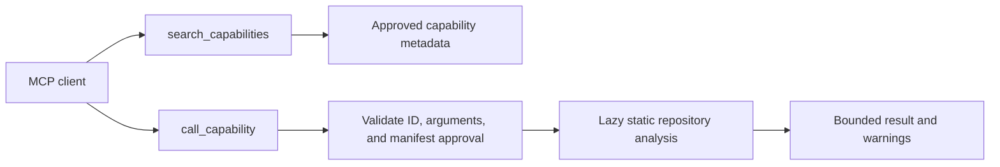

# Apex MCP Foundry

**Connect repositories. Review bounded capabilities. Expose approved tools through one MCP endpoint.**

Apex MCP Foundry is an early, local-first prototype for making a repository portfolio discoverable on demand. It exposes a small MCP bootstrap surface and routes calls to explicit, read-only static-analysis handlers. It does **not** import, execute, install, or build repository code.

## What works today

- `inspect`: inventories a repository, counts languages, parses Python declarations, and reports parse/size/file-limit warnings.
- `init`: creates a draft `.mcp-foundry/capabilities.json`; no handlers are available until an operator reviews it and marks approved handlers.
- `serve`: connects one or more local repository directories over MCP stdio. IDs derive from directory names; duplicate IDs are rejected.
- MCP exposes only `search_capabilities` and `call_capability`. Approved handlers are loaded lazily when called.
- Initial allowlist: `repo.overview`, `repo.search_symbols`, and `repo.get_symbol`. Symbol results contain declaration metadata and docstrings, not source bodies.
- Python runtime uses only the standard library.

The approval manifest is a local operator-controlled configuration boundary, not a cryptographic attestation. Repository content and docstrings can contain sensitive text. Only connect roots you intend to make available to the connected model client.

## Quick start

```bash
python3 -m apex_mcp_foundry inspect /path/to/repository
python3 -m apex_mcp_foundry init /path/to/repository
```

Review the generated manifest at `.mcp-foundry/capabilities.json`. To enable the three read-only handlers, set:

```json
{
  "schema_version": 1,
  "repository_id": "repository-name",
  "status": "approved",
  "approved_handlers": [
    "repo.overview",
    "repo.search_symbols",
    "repo.get_symbol"
  ]
}
```

Then serve one or more repositories over stdio:

```bash
PYTHONPATH=/path/to/apex-mcp-foundry python3 -m apex_mcp_foundry serve /path/to/repository /path/to/another-repository
```

A minimal client config can launch the server locally:

```json
{
  "mcpServers": {
    "apex-mcp-foundry": {
      "command": "python3",
      "args": ["-m", "apex_mcp_foundry", "serve", "/absolute/path/to/repository"],
      "env": {
        "PYTHONPATH": "/absolute/path/to/apex-mcp-foundry"
      }
    }
  }
}
```

## Request flow



## Safety and limits

- This prototype supports local filesystem repositories and MCP stdio only; it has no remote HTTP endpoint, OAuth, tenant model, registry publisher, or hosted runtime.
- It parses Python ASTs and inventories selected source/documentation files from other languages. It does not claim cross-language semantic graphs.
- The analyzer skips common generated/vendor directories, symlinks, common secret filenames/extensions, and files outside its configured limits. This is not a secret scanner; review repository contents and client data handling.
- No repository function, build script, package installer, test command, or generated code is invoked. The three allowed handlers only return bounded static-analysis metadata.
- `readOnlyHint` annotations are descriptive metadata, not authorization. Manifest enforcement occurs in the server handler.
- The server currently has no transport authentication because stdio assumes a trusted local client process. Do not expose this process through a network wrapper without adding authentication, authorization, and sandboxing.
- Tool search is lexical and deterministic, not an LLM relevance or quality guarantee.
- Capability selection, task placement, and workflow scheduling may have NP-hard formulations. This prototype does not claim to solve those optimization problems.
- No latency, memory, cache-hit, token-reduction, or adoption claims are published before controlled benchmarks exist.

## Development

```bash
python3 -m unittest discover -s tests -v
python3 -m py_compile apex_mcp_foundry/*.py tests/*.py
```

## Next milestones

1. Add a versioned capability manifest schema and review/approval UX.
2. Add source-grounded import/call graph export with confidence labels and incremental indexing.
3. Add explicit, signed adapter contracts for selected project tools; keep code execution outside the gateway and isolated.
4. Add authenticated remote transport only after threat modeling and tenant-aware authorization.
5. Benchmark discovery quality, context size, prefix-cache reuse, call correctness, p50/p95 latency, memory, and fully allocated cost against static-list and naive-search baselines.

The generated manifest shape is documented by [`schemas/capability-manifest.schema.json`](schemas/capability-manifest.schema.json). Current MCP manifests are validated in code against the same handler allowlist; the schema is documentation for clients and tooling, not yet a general JSON Schema validation runtime. The benchmark protocol is in [`docs/evaluation-plan.md`](docs/evaluation-plan.md).
