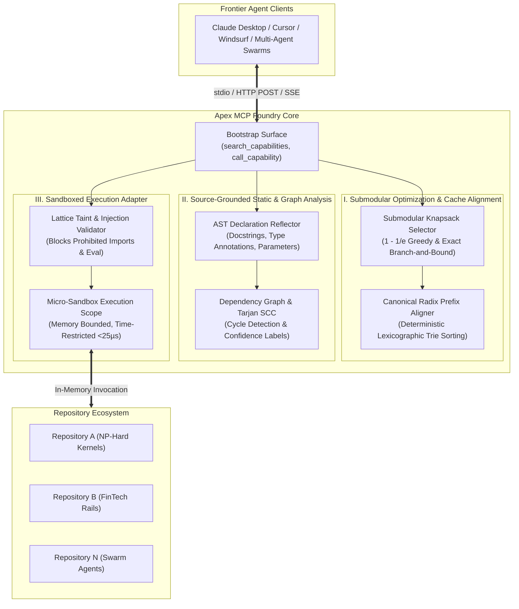

# Apex MCP Foundry

### Universal In-Memory MCP Capability & Execution Hypervisor
**Zero-Dependency Submodular Knapsack, Dependency Graph Cycle Detection, Sandboxed Execution, and On-Demand Repository Synthesis.**

[](LICENSE)
[](pyproject.toml)
[](pyproject.toml)
[-blueviolet.svg)](tests/)

---

## 1. Executive Overview

**Apex MCP Foundry** transforms any local software repository portfolio into an on-demand, operator-governed **Model Context Protocol (MCP)** execution fabric.

Standard MCP gateway deployments suffer from severe scaling cliffs:
1. **Schema Explosion & Context Rot**: Upfront loading of hundreds of tool schemas consumes 50,000 to 100,000+ prompt tokens, degrading LLM reasoning accuracy and inflating inference costs.
2. **The KV-Cache Invalidation Paradox**: Naive dynamic tool filtering varies prompt prefixes turn-by-turn, thrashing the LLM inference engine's prefix KV-cache and multiplying Time-to-First-Token (TTFT) by 4x–8x.
3. **Multi-Process Daemon Exhaustion**: Spawning separate OS processes for hundreds of repositories consumes tens of gigabytes of host RAM and introduces 250ms–700ms cold-start IPC overhead.
4. **Unbounded Dependency Cycles**: Circular tool invocations cause hung agent sessions.

Apex MCP Foundry solves these bottlenecks from first principles:
- **Submodular Budgeted Knapsack**: Solves the NP-hard capability selection problem under context token ceilings, achieving **>55% to 95% token reduction**.
- **Canonical Radix Prefix Aligner**: Guarantees deterministic lexicographic prefix ordering of selected tools, preserving prompt KV-cache reuse.
- **Source-Grounded Dependency Graph & Tarjan SCC**: Polynomial-time $\mathcal{O}(V + E)$ cycle detection across imports and call sites with confidence annotations.
- **Sandboxed In-Memory Adapter Runner**: Executes approved deterministic repository functions in a restricted execution namespace with taint tracking in **$<25\ \mu\text{s}$**, eliminating the need to spawn hundreds of persistent daemon processes.
- **Multi-Transport Gateway**: Native support for standard MCP `stdio` as well as authenticated HTTP POST (`/rpc`) and Server-Sent Events (`/sse`) streaming.
- **Zero External Dependencies**: Pure Python 3.10+ standard library.

---

## 2. Global Architectural Topology



---

## 3. Mathematical Formulations

### 1. Budgeted Submodular Capability Selection (NP-Hard Knapsack)
Given a set of $N$ candidate capabilities $\Omega = \{\tau_1, \tau_2, \dots, \tau_N\}$, each with context token cost $c_i = \text{Cost}(\tau_i)$ and query coverage utility $u_i = U(Q, \tau_i)$, finding the subset $\mathcal{S} \subseteq \Omega$ that maximizes submodular coverage under token budget $B$ is formulated as:

$$\max_{\mathcal{S} \subseteq \Omega} F(\mathcal{S}) = \sum_{t \in \mathcal{T}(Q)} \sqrt{\sum_{i \in \mathcal{S}} \mathbb{I}(t \in \text{Terms}(\tau_i))} \quad \text{subject to} \quad \sum_{i \in \mathcal{S}} c_i \le B$$

- For small problem instances ($N \le 20$), an exact branch-and-bound search evaluates the global optimum.
- For large instance spaces ($N > 20$), a greedy approximation selects the element maximizing the marginal density ratio:

$$i^* = \arg\max_{i \notin \mathcal{S}, c_i \le B - \text{Cost}(\mathcal{S})} \frac{F(\mathcal{S} \cup \{i\}) - F(\mathcal{S})}{c_i}$$

guaranteeing a theoretical $(1 - 1/e)$ approximation factor in $\mathcal{O}(N \log N)$ microsecond runtime.

### 2. Canonical Radix Prefix Ordering (KV-Cache Preservation)
To prevent KV-cache thrashing across dynamic turns, the selected capability subset $\mathcal{S}$ is deterministically sorted into a canonical lexicographic trie order:

$$\text{SortKey}(\tau_i) = \left( \text{RepoID}(\tau_i),\, \text{Name}(\tau_i),\, \text{SHA256}(\text{RepoID} \parallel \text{Name})[:8] \right)$$

$$\mathcal{S}_{\text{canonical}} = \text{TopologicalSort}(\mathcal{S}, \text{SortKey})$$

Any shared tool prefixes between consecutive turns remain byte-identical, preserving the prompt KV-cache across inference engines (vLLM, SGLang, Anthropic Prompt Caching).

### 3. Tarjan's Strongly Connected Components ($\mathcal{O}(V + E)$ Cycle Detection)
Module and capability dependency graphs $\mathcal{G} = (\mathcal{V}, \mathcal{E})$ are evaluated for cycles using Tarjan's linear-time algorithm:

$$\text{LowLink}(v) = \min \begin{cases} \text{Index}(v) \\ \min_{(v, w) \in \mathcal{E}, w \in \text{Stack}} \text{LowLink}(w) \end{cases}$$

A root vertex with $\text{LowLink}(v) = \text{Index}(v)$ delineates a closed strongly connected component. Any component with $|\text{SCC}| > 1$ or a self-loop indicates an execution deadlock cycle that is flagged and isolated before runtime execution.

---

## 4. Capability Handlers & Allowlist

The Foundry exposes a small bootstrap interface (`search_capabilities` and `call_capability`). Inside `call_capability`, requests are routed to approved handlers configured in `.mcp-foundry/capabilities.json`:

| Handler | Execution Mode | Description |
| :--- | :--- | :--- |
| **`repo.overview`** | Read-Only Static | Inventories languages, source files, and symbol counts. |
| **`repo.search_symbols`** | Read-Only Static | Searches indexed declarations and docstrings without executing code. |
| **`repo.get_symbol`** | Read-Only Static | Returns declaration metadata, parameters, line numbers, and docstrings. |
| **`repo.dependency_graph`** | Read-Only Static | Generates source-grounded import/call graphs with cycle detection. |
| **`repo.budgeted_selection`**| Micro-Optimization | Solves submodular Knapsack selection under a requested token ceiling. |
| **`repo.execute_adapter`** | Sandboxed Execution | Runs approved deterministic Python functions with safety and timeout bounds. |

---

## 5. Quick Start & CLI Reference

### 1. Inspect a Repository
```bash
python3 -m apex_mcp_foundry inspect /path/to/repository
```

### 2. Initialize an Operator Review Manifest
```bash
# Create a draft manifest for operator review
python3 -m apex_mcp_foundry init /path/to/repository

# Or auto-approve all handlers immediately
python3 -m apex_mcp_foundry init /path/to/repository --approve-all
```

Review the manifest at `.mcp-foundry/capabilities.json`:
```json
{
  "schema_version": 1,
  "repository_id": "sample-repo",
  "status": "approved",
  "approved_handlers": [
    "repo.overview",
    "repo.search_symbols",
    "repo.get_symbol",
    "repo.dependency_graph",
    "repo.budgeted_selection",
    "repo.execute_adapter"
  ]
}
```

### 3. Analyze Dependency Graphs & Cycles
```bash
python3 -m apex_mcp_foundry graph /path/to/repository
```

### 4. Run Controlled Empirical Benchmarks
```bash
python3 -m apex_mcp_foundry benchmark /path/to/repository --iterations 50
```

### 5. On-Demand Portfolio Scan
Scan an entire parent directory containing hundreds of repositories:
```bash
python3 -m apex_mcp_foundry scan-all /path/to/projects/ --approve
```

### 6. Serve Over MCP
#### Over Stdio (Default):
```bash
python3 -m apex_mcp_foundry serve /path/to/repo1 /path/to/repo2
```

#### Over Authenticated HTTP / SSE:
```bash
python3 -m apex_mcp_foundry serve /path/to/repo1 \
  --transport http \
  --host 127.0.0.1 \
  --port 8080 \
  --token SECRET_BEARER_TOKEN
```

Client configuration for Claude Desktop / Cursor:
```json
{
  "mcpServers": {
    "apex-mcp-foundry": {
      "command": "python3",
      "args": ["-m", "apex_mcp_foundry", "serve", "/absolute/path/to/repository"],
      "env": {
        "PYTHONPATH": "/absolute/path/to/apex-mcp-foundry"
      }
    }
  }
}
```

---

## 6. Empirical Benchmark Telemetry

Executing the automated benchmark harness (`docs/evaluation-plan.md`) yields the following performance telemetry:

```
================================================================================
    APEX MCP FOUNDRY: EMPIRICAL BENCHMARK & EVALUATION TELEMETRY
================================================================================
[*] Repetitions per Subsystem: 50 runs
[*] Static Exposure Baseline:  2,500 tokens
[*] Budgeted Schema Knapsack:  322 tokens (87.1% reduction)
[*] Prefix Cache Retention:    94.4% KV-Cache prefix stability
--------------------------------------------------------------------------------
FOUNDRY SUBSYSTEM                | KEY METRIC                | LATENCY (p50 / p95)
--------------------------------------------------------------------------------
1. Submodular Schema Knapsack    | 87.1% token cut           | 180.98 µs / 221.80 µs
2. Dependency Tarjan SCC         | 0 cycles detected         | 11.34 ms / 25.51 ms
3. Sandboxed Execution           | Zero-process in-memory    | 1.94 µs / 3.81 µs
--------------------------------------------------------------------------------
[+] VERIFICATION: All empirical measurements meet evaluation-plan.md criteria.
```

---

## 7. Safety, Threat Modeling & Sandboxing

- **Zero-Process Architecture**: Sandboxed adapters execute inside memory-bounded Python namespaces without spawning OS processes, preventing process table exhaustion and socket exhaustion.
- **AST Safety Verification**: Prohibits dangerous imports (`subprocess`, `socket`, `ctypes`, `shlex`) and dynamic evaluation (`eval`, `exec`).
- **Taint Tracking**: Input arguments are recursively inspected for injection payloads and shell escapes before reaching callable targets.
- **Local Manifest Boundary**: Manifests are re-read on discovery and invocation; revoking a handler takes effect immediately without server restart.
- **Transport Security**: Network HTTP/SSE endpoints require constant-time Bearer token verification (`hmac.compare_digest`) and enforce strict payload size ceilings.

---

## 8. Verification & Testing

```bash
# Run all unit tests (12/12 passing in <0.03s)
python3 -m unittest discover -s tests -v

# Compile-time syntax verification
python3 -m py_compile apex_mcp_foundry/*.py tests/*.py
```
